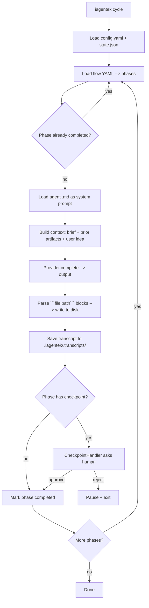

# IAgentek — Architecture

> Technical document about the framework. For product usage see [README.md](./README.md).

## Vision

IAgentek is an `npx`-executable CLI that orchestrates a virtual team of AI agents (BMAD) which produce and consume spec-driven (SDD) artifacts to execute a complete software development cycle.

## Key decisions

### 1. Distribution via `npx`
- **Why:** zero prior install, well-known pattern (`create-next-app`), works on any machine with Node.
- **Trade-off:** Node as a dependency; not viable for environments without Node.

### 2. Monorepo with 3 packages
- **Why:** clear separation of responsibilities. `method` can be updated without touching `core`. `core` can be reused from other runners (CI, future web UI).
- **Trade-off:** a bit more build and versioning overhead.

### 3. Agents as pure markdown
- **Why:** prompts live in `.md` files, not TypeScript code. Anyone (PM, designer, AI) can read and edit them without touching code.
- **Trade-off:** less type-safety in prompts. Compensated by the SDD template defining the expected output.

### 4. Provider auto-detection
- **Why:** the user almost always already has something (Claude CLI, an env API key). Detecting and proposing it reduces friction to ~0.
- **Trade-off:** we need detection code per provider. Acceptable.

### 5. Agent output parsed via ```` ```file:path ```` blocks
- **Why:** simple convention, supported by any LLM, without tool-calling. Works with any provider, doesn't tie us to Anthropic.
- **Trade-off:** depends on the model following the convention. Mitigated by explicit system prompts in each agent.

### 6. State in `.iagentek/state.json`
- **Why:** simple, inspectable, no DB. Each project has its own state.
- **Trade-off:** doesn't scale to teams collaborating in real-time (not the MVP use case).

## Monorepo structure

```
iagentek-framework/
├── package.json                 # npm workspaces
├── tsconfig.base.json           # shared TS config
├── scripts/
│   ├── copy-assets.mjs          # post-build for @iagentek/method
│   ├── fix-bin-shebang.mjs      # post-build for @iagentek/cli
│   └── sync-license.mjs         # distributes root LICENSE to packages
└── packages/
    ├── method/                  # @iagentek/method
    │   ├── package.json
    │   ├── tsconfig.json
    │   ├── src/index.ts         # loaders for agents/templates/flows
    │   └── assets/
    │       ├── agents/*.md      # BMAD prompts (analyst, pm, architect, ...)
    │       ├── templates/*.md   # SDD templates (spec, plan, ...)
    │       └── flows/*.yaml     # cycle definitions
    ├── core/                    # @iagentek/core
    │   ├── package.json
    │   ├── tsconfig.json
    │   └── src/
    │       ├── providers/       # types, anthropic, claude-cli, detect, factory
    │       ├── config/          # yaml loader + defaults
    │       ├── flow/            # yaml loader + PhaseDefinition types
    │       ├── state/           # state.json read/write
    │       ├── checkpoints/     # CheckpointManager + handler interface
    │       ├── orchestrator/    # Orchestrator (runs phases, parses outputs)
    │       └── util/logger.ts
    └── cli/                     # @iagentek/cli
        ├── package.json         # bin: { "iagentek": "./dist/bin/iagentek.js" }
        ├── tsconfig.json
        └── src/
            ├── bin/iagentek.ts  # commander entry
            └── commands/
                ├── init.ts
                ├── cycle.ts
                └── status.ts
```

## `cycle` execution flow



## Key interfaces

### `AIProvider`
```ts
interface AIProvider {
  id: ProviderId;
  displayName: string;
  defaultModel: string;
  complete(messages: ChatMessage[], options?: CompletionOptions): Promise<string>;
}
```
MVP implementations: `AnthropicProvider`, `ClaudeCliProvider`, `OpenAIProvider`, `GeminiProvider`, `DeepSeekProvider`, `OllamaProvider`.

### `CheckpointHandler`
```ts
type CheckpointHandler = (ctx: CheckpointContext) => Promise<{
  decision: 'approve' | 'reject' | 'edit';
  notes?: string;
}>;
```
The CLI implementation uses `prompts` to ask interactively. In the future: CI handler (auto-approve), web UI handler, etc.

### `PhaseDefinition` (in flows/*.yaml)
```yaml
- id: discovery
  name: Discovery & Problem Definition
  agent: analyst
  inputs: [user.idea, user.project_name]
  outputs: [.iagentek/project-brief.md, .iagentek/constitution.md]
  checkpoint:
    id: discovery-approved
    mode: required
    prompt: "The Analyst generated..."
```

## How to add a new agent
1. Create `packages/method/assets/agents/<name>.md` with the full prompt.
2. Add the type in `packages/method/src/index.ts` (`AgentRole`).
3. Reference it in a flow YAML as `agent: <name>`.

## How to add a new provider
1. Create `packages/core/src/providers/<name>.ts` implementing `AIProvider`.
2. Add it to `factory.ts` (`createProvider`).
3. Add detection in `detect.ts`.
4. Add its env var in `config/loader.ts` (`envVarFor`).

## How to add a new flow
1. Create `packages/method/assets/flows/<name>.yaml`.
2. Use it via `iagentek init --flow <name>` or change in `config.yaml`.

## Known MVP limitations
- The agent prompts (in `packages/method/assets/agents/`) are written in Spanish — they produce artifacts in whichever language the user requests, but the prompts themselves haven't been translated yet.
- No automatic retry if the model doesn't respect the `file:path` convention.
- No token streaming to the user (the full response arrives at once).
- No real per-story loop in the implementation phase yet.
