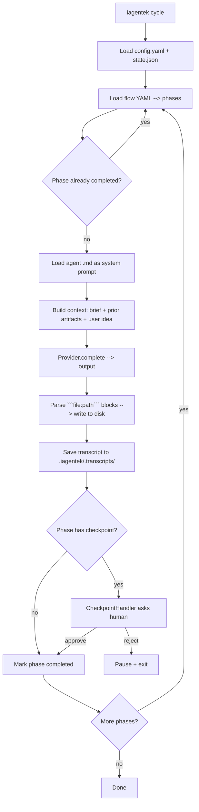

# IAgentek — Arquitectura

> Documento técnico del framework. Para uso del producto ver [README.md](./README.md).

## Visión

IAgentek es un CLI ejecutable por `npx` que orquesta un equipo virtual de agentes IA (BMAD) que producen y consumen artefactos spec-driven (SDD) para ejecutar un ciclo completo de desarrollo de software.

## Decisiones clave

### 1. Distribución vía `npx`
- **Por qué:** cero instalación previa, patrón conocido (`create-next-app`), funciona en cualquier máquina con Node.
- **Trade-off:** Node como dependencia; no es viable para entornos sin Node.

### 2. Monorepo con 3 paquetes
- **Por qué:** separación clara de responsabilidades. `method` se puede actualizar sin tocar `core`. `core` se puede reutilizar desde otros runners (CI, web UI futura).
- **Trade-off:** un poco más de overhead de build y versionado.

### 3. Agentes como markdown puro
- **Por qué:** los prompts viven en archivos `.md`, no en código TypeScript. Cualquiera (PM, diseñador, IA) los puede leer y editar sin tocar código.
- **Trade-off:** menos type-safety en los prompts. Compensado con la plantilla SDD que define el output esperado.

### 4. Auto-detección de provider
- **Por qué:** el usuario casi siempre ya tiene algo (Claude CLI, una API key en env). Detectarlo y proponerlo reduce fricción a ~0.
- **Trade-off:** necesitamos código de detección por cada provider. Aceptable.

### 5. Output del agente parseado por bloques ```` ```file:ruta ````
- **Por qué:** convención simple, soportada por cualquier LLM, sin tool-calling. Funciona con cualquier provider, no nos amarra a Anthropic.
- **Trade-off:** depende de que el modelo siga la convención. Mitigado por system prompts explícitos en cada agente.

### 6. State en `.iagentek/state.json`
- **Por qué:** simple, inspeccionable, sin DB. Cada proyecto tiene su propio estado.
- **Trade-off:** no escala a equipos colaborando en tiempo real (no es el caso de uso del MVP).

## Estructura del monorepo

```
FramworkIAgentek/
├── package.json                 # workspaces npm
├── tsconfig.base.json           # config TS compartida
├── scripts/
│   ├── copy-assets.mjs          # post-build de @iagentek/method
│   └── fix-bin-shebang.mjs      # post-build de @iagentek/cli
└── packages/
    ├── method/                  # @iagentek/method
    │   ├── package.json
    │   ├── tsconfig.json
    │   ├── src/index.ts         # loaders de agents/templates/flows
    │   └── assets/
    │       ├── agents/*.md      # prompts BMAD (analyst, pm, architect, ...)
    │       ├── templates/*.md   # plantillas SDD (spec, plan, ...)
    │       └── flows/*.yaml     # definiciones de ciclo
    ├── core/                    # @iagentek/core
    │   ├── package.json
    │   ├── tsconfig.json
    │   └── src/
    │       ├── providers/       # types, anthropic, claude-cli, detect, factory
    │       ├── config/          # loader yaml + defaults
    │       ├── flow/            # loader yaml + tipos PhaseDefinition
    │       ├── state/           # state.json read/write
    │       ├── checkpoints/     # CheckpointManager + handler interface
    │       ├── orchestrator/    # Orchestrator (corre fases, parsea outputs)
    │       └── util/logger.ts
    └── cli/                     # @iagentek/cli
        ├── package.json         # bin: { "iagentek": "./dist/bin/iagentek.js" }
        ├── tsconfig.json
        └── src/
            ├── bin/iagentek.ts    # commander entry
            └── commands/
                ├── init.ts
                ├── cycle.ts
                └── status.ts
```

## Flujo de ejecución de `cycle`



## Interfaces clave

### `AIProvider`
```ts
interface AIProvider {
  id: ProviderId;
  displayName: string;
  defaultModel: string;
  complete(messages: ChatMessage[], options?: CompletionOptions): Promise<string>;
}
```
Implementaciones MVP: `AnthropicProvider`, `ClaudeCliProvider`.

### `CheckpointHandler`
```ts
type CheckpointHandler = (ctx: CheckpointContext) => Promise<{
  decision: 'approve' | 'reject' | 'edit';
  notes?: string;
}>;
```
La implementación de CLI usa `prompts` para preguntar interactivamente. En el futuro: handler para CI (auto-approve), handler para web UI, etc.

### `PhaseDefinition` (en flows/*.yaml)
```yaml
- id: discovery
  name: Discovery & Problem Definition
  agent: analyst
  inputs: [user.idea, user.project_name]
  outputs: [.iagentek/project-brief.md, .iagentek/constitution.md]
  checkpoint:
    id: discovery-approved
    mode: required
    prompt: "El Analyst generó..."
```

## Cómo agregar un nuevo agente
1. Crear `packages/method/assets/agents/<nombre>.md` con el prompt completo.
2. Añadir el tipo en `packages/method/src/index.ts` (`AgentRole`).
3. Referenciarlo en un flow YAML como `agent: <nombre>`.

## Cómo agregar un nuevo provider
1. Crear `packages/core/src/providers/<nombre>.ts` que implemente `AIProvider`.
2. Añadirlo al `factory.ts` (`createProvider`).
3. Añadir su detección en `detect.ts`.
4. Añadir su env var en `config/loader.ts` (`envVarFor`).

## Cómo agregar un nuevo flow
1. Crear `packages/method/assets/flows/<nombre>.yaml`.
2. Usar en `iagentek init --flow <nombre>` o cambiar en `config.yaml`.

## Limitaciones conocidas del MVP
- Solo provider Anthropic + Claude CLI (otros llegan en iteración 2).
- Solo flow greenfield (brownfield, bugfix, refactor en iteración 2-3).
- Dev/QA/DevOps son stubs — el ciclo se detiene tras la fase de Architect.
- No hay retry automático si el modelo no respeta la convención `file:path`.
- No hay streaming de tokens al usuario (la respuesta llega completa).
